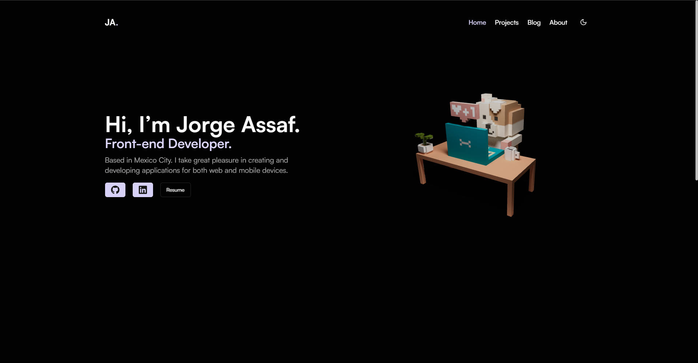

# Jorge Assaf Portfolio

## Tech Stack

- **Framework:** [Next.js](https://nextjs.org)
- **Styling:** [Tailwind CSS](https://tailwindcss.com)
- **Animation:** [Framer Motion](https://www.framer.com/motion/)
- **3D:** [Three.js](https://threejs.org) and [React Three Fiber](https://docs.pmnd.rs/react-three-fiber/getting-started/introduction)
- **UI Components:** [shadcn/ui](https://ui.shadcn.com)
- **CMS:** [Sanity](https://sanity.io)

## Features implemented

- [x] Next.js app directory
- [x] Write in TypeScript
- [x] Implement 3D with Three.js and React Three Fiber
- [x] Use 75ch width in blog and about page
- [x] Query params for blog categories
- [x] Use Sanity for blog and projects

## Learn More

To learn more about Next.js and the technologies used in this project, take a look at the following resources:

- [Next.js Documentation](https://nextjs.org/docs) - learn about Next.js features and API.
- [Learn Next.js](https://nextjs.org/learn) - an interactive Next.js tutorial.
- [TailwindCSS](https://tailwindcss.com/docs) - learn about TailwindCSS features and API.
- [FramerMotion](https://www.framer.com/motion/) - learn about
  FramerMotion features and API.
- [Sanity](https://www.sanity.io/docs) - learn about Sanity features and API.
- [Shadcn](https://ui.shadcn.com/) - learn about Shadcn features and API.

## Deploy on Vercel

The easiest way to deploy your Next.js app is to use the [Vercel Platform](https://vercel.com/new?utm_medium=default-template&filter=next.js&utm_source=create-next-app&utm_campaign=create-next-app-readme) from the creators of Next.js.

Check out our [Next.js deployment documentation](https://nextjs.org/docs/deployment) for more details.
